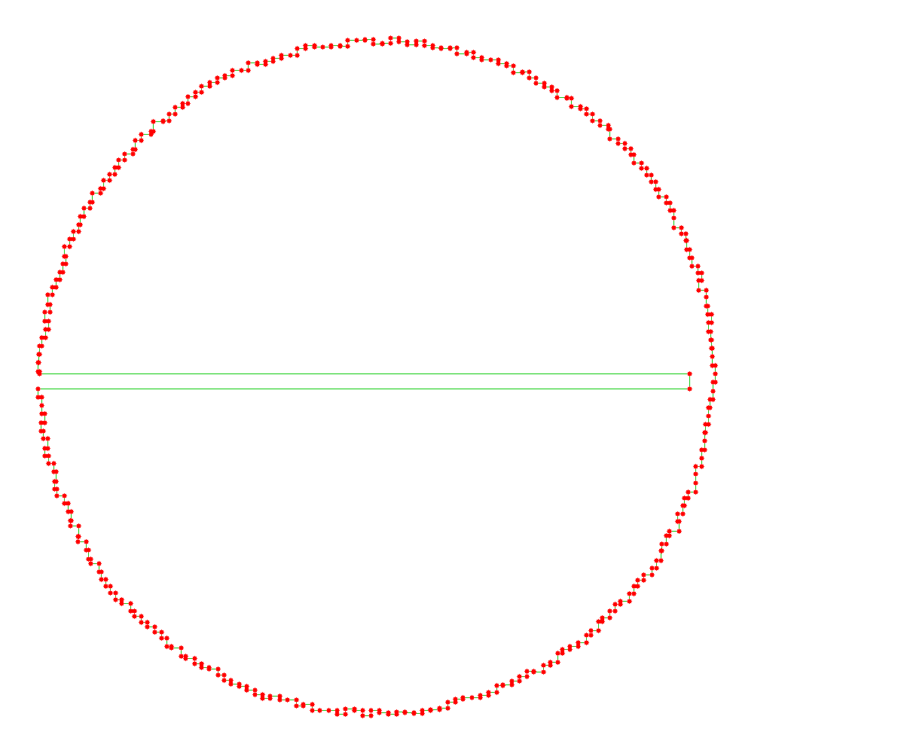
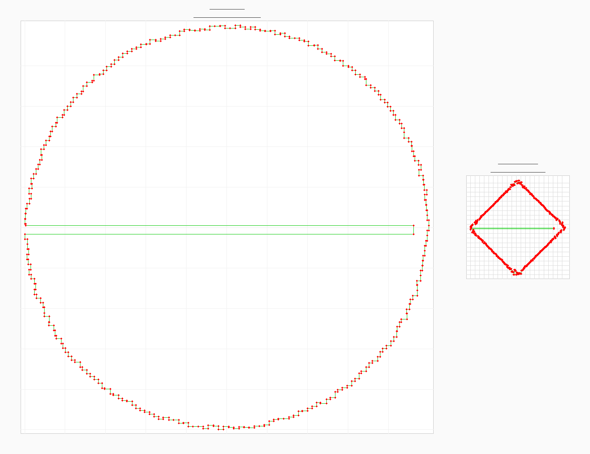

# Day 9: Movie Theater

You slide down the firepole in the corner of the playground and land in the North Pole base movie theater!

The movie theater has a big tile floor with an interesting pattern. Elves here are redecorating the theater by switching out some of the square tiles in the big grid they form. Some of the tiles are red; the Elves would like to find the largest rectangle that uses red tiles for two of its opposite corners. They even have a list of where the red tiles are located in the grid (your puzzle input).

## Input Visualization



*496 red tiles forming a closed polygon spanning ~97K × ~97K coordinate space (compressed to 248 × 247 unique coordinates)*

---

## Part 1

### Example Input

```
7,1
11,1
11,7
9,7
9,5
2,5
2,3
7,3
```

Showing red tiles as `#` and other tiles as `.`, the above arrangement of red tiles would look like this:

```
..............
.......#...#..
..............
..#....#......
..............
..#......#....
..............
.........#.#..
..............
```

You can choose any two red tiles as the opposite corners of your rectangle; your goal is to find the largest rectangle possible.

### Example Rectangles

**Rectangle with area 24** between `2,5` and `9,7`:

```
..............
.......#...#..
..............
..#....#......
..............
..OOOOOOOO....
..OOOOOOOO....
..OOOOOOOO.#..
..............
```

**Rectangle with area 35** between `7,1` and `11,7`:

```
..............
.......OOOOO..
.......OOOOO..
..#....OOOOO..
.......OOOOO..
..#....OOOOO..
.......OOOOO..
.......OOOOO..
..............
```

**Thin rectangle with area 6** between `7,3` and `2,3`:

```
..............
.......#...#..
..............
..OOOOOO......
..............
..#......#....
..............
.........#.#..
..............
```

**Largest rectangle with area 50** between `2,5` and `11,1`:

```
..............
..OOOOOOOOOO..
..OOOOOOOOOO..
..OOOOOOOOOO..
..OOOOOOOOOO..
..OOOOOOOOOO..
..............
.........#.#..
..............
```

### Question

Using two red tiles as opposite corners, what is the largest area of any rectangle you can make?

**Your puzzle answer was `4765757080`.**

---

## Part 2

The Elves just remembered: they can only switch out tiles that are red or green. So, your rectangle can only include red or green tiles.

In your list, every red tile is connected to the red tile before and after it by a straight line of green tiles. The list wraps, so the first red tile is also connected to the last red tile. Tiles that are adjacent in your list will always be on either the same row or the same column.

### Green Tiles

Using the same example as before, the tiles marked `X` would be green:

```
..............
.......#XXX#..
.......X...X..
..#XXXX#...X..
..X........X..
..#XXXXXX#.X..
.........X.X..
.........#X#..
..............
```

In addition, all of the tiles inside this loop of red and green tiles are also green. So, in this example, these are the green tiles:

```
..............
.......#XXX#..
.......XXXXX..
..#XXXX#XXXX..
..XXXXXXXXXX..
..#XXXXXX#XX..
.........XXX..
.........#X#..
..............
```

The remaining tiles are never red nor green.

The rectangle you choose still must have red tiles in opposite corners, but any other tiles it includes must now be red or green. This significantly limits your options.

### Example Rectangles (Part 2)

**Rectangle with area 15** between `7,3` and `11,1`:

```
..............
.......OOOOO..
.......OOOOO..
..#XXXXOOOOO..
..XXXXXXXXXX..
..#XXXXXX#XX..
.........XXX..
.........#X#..
..............
```

**Thin rectangle with area 3** between `9,7` and `9,5`:

```
..............
.......#XXX#..
.......XXXXX..
..#XXXX#XXXX..
..XXXXXXXXXX..
..#XXXXXXOXX..
.........OXX..
.........OX#..
..............
```

**Largest rectangle with area 24** between `9,5` and `2,3`:

```
..............
.......#XXX#..
.......XXXXX..
..OOOOOOOOXX..
..OOOOOOOOXX..
..OOOOOOOOXX..
.........XXX..
.........#X#..
..............
```

### Question

Using two red tiles as opposite corners, what is the largest area of any rectangle you can make using only red and green tiles?

**Your puzzle answer was `1498673376`.**

---

## Solution Notes

### Part 1
- Simple brute force checking all pairs of red tiles
- Fast enough with just red tile validation

### Part 2
- **Brute Force**: 5m 40s - Lazy polygon checks with 22M cache
- **Optimized**: 452ms - Coordinate compression transforms 97K×97K space into 248×247 compressed grid
- **Speedup**: ~750x faster!

The key insight: 496 red tiles only use 248 unique X coordinates and 247 unique Y coordinates. Compress coordinates and pre-fill the entire polygon interior in compressed space.

### Coordinate Compression Visualization



**Left (large)**: Original sparse space (97K × 97K = 9.4B cells) - notice the light grid showing vast empty regions
**Right (tiny)**: Compressed dense space (248 × 247 = 61K cells) - every coordinate is actually used

**The size difference is the point!** The visual scale represents the actual data compression - from a massive sparse grid to a tiny dense grid.

**Compression ratio**: ~153,000:1

The topology is preserved (same polygon shape), but the metric distances are lost. Since we only need to know if points are inside/outside the polygon (topology), not their actual distances (metric), compression works perfectly!

Both parts complete! ⭐⭐
